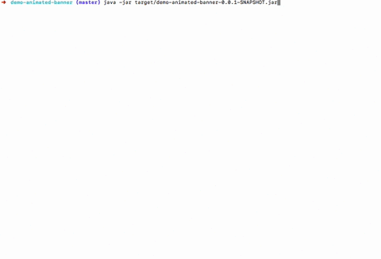

#	Spring Boot 2.0 Release Notes
##	从Spinrg Boot 1.5 升级
由于这是 Spring Boot 一个主要版本，升级会比现有版本更复杂一些。我们针对 Spring Boot 1.5 的应用提供了[升级指南](https://github.com/spring-projects/spring-boot/wiki/Spring-Boot-2.0-Migration-Guide)。

如果现在你正在使用 Spring Boot 更旧的版本，在升级到 2.0 前强烈建议你先升级到 [Spring Boot 1.5](https://github.com/spring-projects/spring-boot/wiki/Spring-Boot-1.5-Release-Notes)。

##	新特性
>配置的 [changelog](https://github.com/spring-projects/spring-boot/wiki/Spring-Boot-2.0-Configuration-Changelog) 文档。

###	Java8 和 Java9
Spring Boot 2.0 最低版本需要 Java8。为了使用 Java8 一些特性比如接口中的默认方法、函数回调和新 api（比如 javax.time）。如果您目前使用 Java7 或更早版本，那么在开发 Spring Boot 2.0 应用之前，需要升级JDK。

Spring Boot 2.0 表现良好，在 JDK9 下进行过测试。为了模块系统兼容性，我们所有 jar mainfests 中都自动附带了模块明细。

###	升级第三方Jar
SpringBoot 2.0 基于 Spring Framework 5，你可能想了解 [Spring Framework 5.0 新特性](https://github.com/spring-projects/spring-framework/wiki/What%27s-New-in-Spring-Framework-5.x)，并在继续之前了解[升级指南](https://github.com/spring-projects/spring-framework/wiki/Upgrading-to-Spring-Framework-5.x)。

我们尽可能的把第三方 Jar 升级到最新的稳定版。这里有一些值得注意的依赖关系升级包括：

*	Tomcat 8.5
* 	Flyway 5
*  	Hibernate 5.2
*	Thymeleaf 3

###	Reactive Spring
现在 Spring 体系中的许多项目为开发[响应式应用](https://github.com/reactive-streams/reactive-streams-jvm#reactive-streams)提供了一流的支持。响应式应用程序是完全异步和非阻塞的。它们用于事件循环执行模型(而不是传统的每个请求一个线程的执行模型)。Spring Framework 参考文档中的 ["Web on Reactive Stack"](https://docs.spring.io/spring/docs/current/spring-framework-reference/web-reactive.html) 部分为这个主题提供了一个很好的入门教程。

Spring Boot 2.0 通过自动配置和 starter-pom 来完全支持响应式应用。Spring 本身的内部构件也在需要时进行了更新，以提供响应式功能特性(最值得注意的是我们支持内置应用服务器
)。

###	Spring WebFlux & WebFlux.fn
Spring WebFlux 是 Spring MVC 一个完整的非阻塞响应式替代方案。Spring Boot 为基于注释的 Spring WebFlux 应用和 WebFlux 提供了自动配置。同时 WebFlux 也提供了一套功能更强大的 API。

要开始使用的话，需要引入 spring-boot-starter-webflux 这个 POM，它将提供由内嵌 Netty 服务器支持的 Spring WebFlux。详细信息，请参阅 [Spring Boot参考文档](https://docs.spring.io/spring-boot/docs/2.0.x/reference/htmlsingle/#boot-features-developing-web-applications)。

###	Reactive Spring Data
在底层技术需要时，Spring Data 同样也支持反应式应用。目前，Cassandra、MongoDB、Couchbase 和 Redis 都有灵活的 API。

Spring Boot 提供了这些技术的特殊 starter-pom。例如，spring-boot-start-data-mongodb-reactive 包含了对响应性 mongo 驱动和响应式项目的依赖。

###	Reactive Spring Security
Spring Boot 2.0 可以使用 Spring Security 5.0来保护你的 Reactive 应用。当使用 Spring Security 时，我们为 WebFlux 应用提供了自动配置。

通过 SecurityWebFilterChain 可以配置 Spring Security 的访问规则。如果你之前使用过 SpringMVC 下的 Spring Security，那这块应该很熟悉。详情可参考 [Spring Boot 相关文档](https://docs.spring.io/spring-boot/docs/2.0.x/reference/htmlsingle/#boot-features-security-webflux) 和 [Spring Security 文档](https://docs.spring.io/spring-security/site/docs/5.0.0.RELEASE/reference/htmlsingle/#jc-webflux)。

###	内嵌 Netty Server
自从 WebFlux 不再依赖 Servlet API，我们首次提供了对 Netty 作为内置应用服务器的支持。spring-boot-starter-webflux POM 将引入 Netty 4.1 和 [Ractor Netty](https://github.com/reactor/reactor-netty)。

>你只能将 Netty 作为响应式服务器来使用，不支持阻塞 Servlet API。

##	HTTP/2
Tomcat、Undertow 和 Jetty 已经支持 HTTP/2，这取决于你选择的应用服务器和运行环境（因为 JDK8 不支持开箱即用的协议）。

详情参考 ["how to"](https://docs.spring.io/spring-boot/docs/2.0.x/reference/htmlsingle/#howto-configure-http2) 部分。

##	配置绑定
用于将环境属性绑定到 @ConfigurationProperties 的机制在 Spring Boot 2.0 中得到了彻底改进。我们利用这个机会加强了管理松散绑定的规则，并从 Spring Boot 1.x 中修复了许多不一致之处。

新 API Binder 可以在 @ ConfigurationProperties 之外直接在代码中使用。举个例子，下面将绑定一个 PersonName 集合对象：

```
List<PersonName> people = Binder.get(environment)
    .bind("my.property", Bindable.listOf(PersonName.class))
    .orElseThrow(IllegalStateException::new);
```

在 YAML 中配置：

```
my:
  property:
  - first-name: Jane
    last-name: Doe
  - first-name: John
    last-name: Doe
```

绑定规则的详情可参考这个[文档](https://github.com/spring-projects/spring-boot/wiki/Relaxed-Binding-2.0)。

### 配置源文件
通过 SpringBoot 加载的 YAML 文件和 Properties 文件现在包含了 Origin 信息，可以帮助你跟踪配置是从哪里加载进来的。Spring 一些特性利用这一点在适当的时候展示出来。

举个例子，在 OriginProvider 中绑定失败时会抛出 BindException。也就是说当绑定失败时能给出详细的错误信息。

另一个例子是 env actuator endpoint 能包含配置源。下面代码段可以看到 spring.security.user.name 来自应用 jar 的 application.properties 文件第一行二十七列：

```
{
  "name": "applicationConfig: [classpath:/application.properties]",
  "properties": {
    "spring.security.user.name": {
      "value": "user",
      "origin": "class path resource [application.properties]:1:27"
    }
  }
}
```

###	Converter
绑定使用了新的  ApplicationConversionService 类，这个类提供一些额外的转换器，这对属性绑定特别有用。最值得注意的是用于持续时间类型和分割字符串的转换器。

Duration 转换器允许以 ISO-8601 形式指定持续时间，或者以简单字符串形式指定持续时间（例如 通过[单位转换](https://docs.spring.io/spring-boot/docs/2.0.x/reference/htmlsingle/#boot-features-external-config-conversion-duration) 10m 代表 10分钟）。现有属性已变更为使用持续时间。例如，在应用中将 session 超时设置为 180s，配置如下：

```
server.servlet.session.timeout=180s
```

@DurationUnit 通过指定未曾使用过的单位来确保向后兼容性。例如，在 Spring Boot 1.5 中使用秒的属性有 @DurationUnits(ChronoUnit.SECONDS)，赋值 10 代表使用 10 秒。

分隔字符串的转换可以帮你把简单字符串绑定到集合或数组，而不必在逗号上进行分隔。例如，LDAP 基于 @Delimiter(Delimiter.NONE) 以致 LDAP DNs（通常包括逗号） 看起来清晰。

##	Gradle 插件
Spring Boot Gradle插件进行了大量重构，以实现一些重大改进。你可以从插件[资料](http://docs.spring.io/spring-boot/docs/2.0.x/gradle-plugin/reference)和[API](https://docs.spring.io/spring-boot/docs/2.0.0.BUILD-SNAPSHOT/gradle-plugin/api/)文档中获取详细信息。

Spring Boot 现在需要 Gradle 4.x。如果你要升级一个使用了Gradle的工程，请参考[迁移指南](https://github.com/spring-projects/spring-boot/wiki/Spring-Boot-2.0-Migration-Guide)。

##	Kotlin
Spring Boot 2.0 现在支持 Kotlin 1.2，提供了一个 runApplication 函数，该函数支持使用惯用 Kotlin 语法运行 Spring 应用的方法。我们公开并影响了其他Spring项目(如Spring Framework、Spring Data和Reactor)在其最近的版本中添加的Kotlin支持。

详细信息，请参考[Kotlin Support](https://docs.spring.io/spring-boot/docs/2.0.x/reference/htmlsingle/#boot-features-kotlin)。

## Actuator 改进
Spring Boot 2.0 对 actuator 端点进行了多项改进，所有端点现在均参与负载并以 JSON 形式暴露在 /actuator 路径下。

默认情况下，很多端点也不被公开暴露。你如果正在从 Spring Boot 1.5 升级，请查[迁移指南](https://github.com/spring-projects/spring-boot/wiki/Spring-Boot-2.0-Migration-Guide)并特别注意 management.endpoints.web.exposure.include 配置项。

### Actuator JSON
现在 Spring Boot 2.0 中，JSON 从多个端点负载而来。

很多端点现在都有 JSON，它可以更准确反映底层数据。例如，/actuator/conditions（在Spring Boot 1.5中是 /autoconfig）现在有一个顶级Key contexts，可以根据 ApplicationContext 进行分组。

现在可以使用 [Spring REST Docs](https://docs.spring.io/spring-boot/docs/2.0.x/actuator-api/html/) 生成大量 [REST API文档](https://spring.io/projects/spring-restdocs)，并随每个 release 版本一起发布。

### 支持Jersey, WebFlux
除 Spring MVC 和 JMX 支持之外，现在在开发 Jersey 和 WebFlux 应用时使用 actuator。Jersey 可以自定义 Jersey Resource，WebFlux 可以自定义 HandlerMapping。

### 超媒体
/actuator 现在对所有活动端点提供 HAL 格式的信息（即使 classpath 中没有 Spring HATEOAS）。

### Actuator @Endpoints
为了支持 SpringMVC、JMX、WebFlux 和 Jersey，我们开发了一个新的 actuator 模型。以一种与技术无关的方式开发，注解 @Endpoint 可以和 @ReadOperation、@WriteOperation 和 @DeleteOperation 一块使用。

你还可以使用 @EndpointWebExtension 或 @EndpointJmxExtension 来实现对端点的增强。详细信息，参考[更新文档](https://docs.spring.io/spring-boot/docs/2.0.x/reference/htmlsingle/#production-ready-endpoints-custom)。

### Micrometer
Spring Boot 2.0 不再附带自身的 metrics API。我们依赖 [micrometer.io](https://micrometer.io/)实现所有应用监控。

Micrometer 包括了对 metrics 维度的支持，当与监控系统相结合时，允许高效访问特定命名的 metric，并获取维度。

Metrics 可以被导出到很多系统中，开箱即用的 Spring Boot 2.0 提供了对 Atlas, Datadog, Ganglia, Graphite, Influx, JMX, New Relic, Prometheus, SignalFx, StatsD 和 Wavefront 的支持。对其它在内存中的 metrics 同样有效。 

集成提供 JVM 指标（包括CPU、内存、线程和GC）、Logback、Tomcat、Spring MVC 和 RestTemplate。

更多细节，请参考更新文档中的 [Metrics 部分](https://docs.spring.io/spring-boot/docs/2.0.x/reference/htmlsingle/#production-ready-metrics)。

### 数据支持
除了上面提到的 “Reactive Spring Data” 外，在数据这块还有一些其他的升级。

#### HikariCP
在 SpringBoot2.0 中，默认数据库连接池从 Tomcat 换成了 HikariCP。我们发现 Hikari 表现更好，相比 Tomcat 更受用户欢迎。

#### 初始化
在 SpringBoot 2.0 中，优化了数据库初始化逻辑。默认情况下，Spring Batch、Spring Integration、Spring Session 和 Quartz 只在显示开启或使用内置数据库时候才做初始化。举个例子，如果你总是想初始化 Spring Batch，你可以配置 spring.batch.initialize-schema=always。

如果你使用 Flyway 或 Liquibase 管理内置数据库，Spring Boot 会自动关闭 Hibernate 的 automic DDL 特性。

#### JOOQ
Spring Boot 2.0 现在可以根据数据源自动检测 jOOQ 方言(类似于JPA方言)。还引入了一个新的 @JooqTest 注释，以简化使用 jOOQ 的测试。

#### JdbcTemplate
现在可以使用 spring.jdbc.template 对 JdbcTemplate 进行自动配置绑定。同时，自动装配的 NamedParameterJdbcTemplate 也会在后台重用 JdbcTemplate。

#### Spring Data Web 配置
Spring Boot 提供了一个新的配置 spring.data.web，可以轻松配置分页和排序。

#### Influx DB
Spring Boot 现在对开源时间序列数据库 InfluxDB 提供配置绑定。要启用 Influx DB，需要设置 spring.influx.url，并在 classpath 中包含 influx-db-java。

#### 灵活的 Flyway/Liquibase
如果只提供自定义的 url 或 user 配置属性，Flyway 和 Liquibase 现在使用标准数据源的配置。在迁移数据源时可以自定义 DataSource。

#### Hibernate
现在支持自定义 Hibernate 命名策略。对于高级场景，可以自定义 ImplicitNamingStrategy 或 PhysicalNamingStrategy 作为常规 bean 在上下文中使用。
现在还能通过配置 HibernatePropertiesCustomizer 属性以更细粒度方式配置 Hibernate。

#### 自定义 MongoDB Client
Spring Boot 允许对 Mongo 客户端进行高级定制，新开放了  MongoClientSettingsBuilderCustomizer bean。

#### Redis
现在使用 spring.cache.redis.* 对默认缓存 Redis 进行配置。

### Web
除了上面提到对 WebFlux 和 WebFlux.fn 的支持，在开发 Web 应用时还做了以下改进。

#### 日志记录 Context Path
在使用一个内置容器时，context path 会在应用启动时被日志输出在 HTTP 端口边上。举个例子，内置 Tomcat 现在会是这样：

```
Tomcat started on port(s): 8080 (http) with context path '/foo'
```

#### Web Filter 初始化
在支持的容器上，过滤器更快被初始化。

#### Thymeleaf
Thymeleaf starter 组件现在通过 thymeleaf-extras-java8time 来支持 javax.time 类型。

#### JSON
一个新的 spring-boot-starter-json 组件将收集读写 JSON 所需的数据。它不仅提供了 jackson-databind，还在使用 java8 时提供了对应模块 jackson-datatype-jdk8, jackson-datatype-jsr310 和 jackson-module-parameter-names。这个组件现在替代了之前 jackson-databind 模块。

如果你不喜欢 Jackson，在 Spring Boot 2.0 中对 Gson 的支持得到了很大改进。我们还引入了对 Json—B 的支持（包括 Json-B 的测试）。

### Quartz
现在对 Quartz 调度器提供了自动配置功能。同时也新增了一个 spring-boot-starter-quartz 的 POM 引用。

你可以使用内存级别的 JobStores 或由 JDBC 进行持久化的存储。JobDetail, Calendar 和 Triiger 这些 bean 会在 Spring 应用上下文中会被 Scheduler 自动注册。

更多详情请参考新的["Quartz Scheduler"](https://docs.spring.io/spring-boot/docs/2.0.x/reference/htmlsingle/#boot-features-quartz)相关章节。

### 测试
在 SpringBoot 2.0 中对测试提供一些新的支持及调整：

* 新的 @WebFluxTest 注解支持 WebFlux 应用的 “slice” 测试。
* Converter 和 GenericConverter 现在通过 @WebMvcTest 和 @WebFluxTest 自动注册。
* 新的 @AutoConfigureWebTestClient 注解被用来支持 WebTestClient。这个注解也会被用于 @WebFluxTest。
* 新的 ApplicationContextRunner 被用来测试你的自动配置。我们已经将大部分内部测试迁移到这个新模型中。详情参考[文档](https://docs.spring.io/spring-boot/docs/2.0.x/reference/htmlsingle/#boot-features-test-autoconfig)。

### 杂项
除了上面提到的变化之外，也有很多小的调整和改进，包括：

* @ConditionalOnBean 在确定是否满足逻辑条件时使用逻辑 AND，而不是 OR。
* 没有条件判断的类现在会在自动配置绑定报告中体现。
* Spring CLI 提供一个 encodepassword 命令用以创建与 Spring Security 兼容的哈希密码。
* 可以使用 scheduledtasks actuator 来查看调度任务。
* loggers actuator 允许你重置当前日志等级为默认。 
* sessions actuator 可以被用来查看和删除 Spring  用户的 session。
* 基于 maven 的 spring-boot-starter-parent 现在默认使用 -parameters 作为标识。
* 我们现在使用 [concourse](http://concourse.ci/) 做构建，工程的 POM 文件也被重构，这样看起来更加简洁。（这些更改对大多数用户是透明的，但如果你发现任何发布的 POM 问题请及时[反馈](https://github.com/spring-projects/spring-boot/issues)）。


### 动态 ASCII
最后，为了好玩，Spring Boot 2.0 现在支持用 GIF 作为 banner。参考这个[例子](https://github.com/snicoll-demos/demo-animated-banner)。




